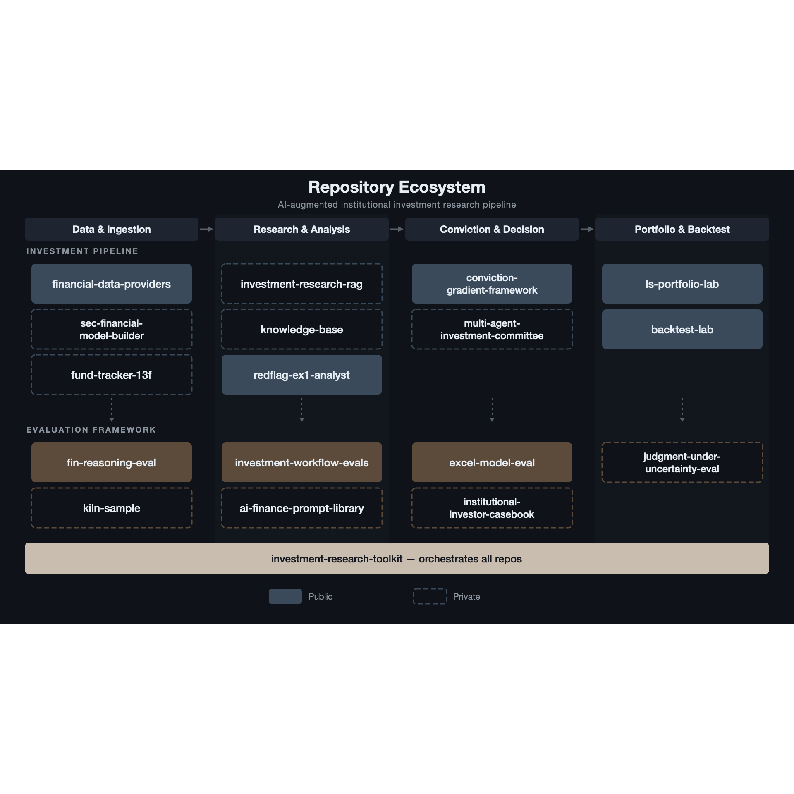

## An open and evolving collection of repos exploring how AI, fundamental, and quantitative methods apply to institutional investment research.

Distilling institutional finance domain expertise into code. Built on long/short equity portfolio management experience and academic research, these repositories are working and learning tools to structure workflows and train AI models. Input and perspectives are always welcome.

Created and maintained by a former long/short equity portfolio manager with 20+ years of institutional buy-side experience.

*Curiosity compounds. Rigor endures.*

---

## Current Focus
Decomposing institutional investment workflow into evaluable, code-readable steps: identify discrete catalysts and quantify their conditional risk/reward (quantitative and fundamental) → map cross-sectional and cross-asset dependencies → encode deterministic event paths → attribute return and risk to systematic (beta) versus idiosyncratic (alpha) drivers, monitoring factor exposure and adjusting it deliberately rather than neutralizing by default → size in portfolio context by idiosyncratic conviction and residual variance. Each step carries an explicit rubric and adversarial tests (discretionary process -> components an AI model can be scored against.)

---

## Repositories

### Evaluation Frameworks

**[investment-workflow-evals](https://github.com/bdschi1/investment-workflow-evals)** — Scoring rubrics for the full institutional workflow (thesis → catalysts → sizing → risk → monitoring → post-mortem). Adversarial variants target LLM failure modes: regime-blind extrapolation, confident nonsense on illiquid names, circular reasoning.

**[fin-reasoning-eval](https://github.com/bdschi1/fin-reasoning-eval)** — 360 finance reasoning problems across 7 categories (earnings surprises, DCF sanity, accounting red flags, catalyst ID, formula audits, statement analysis, risk) and 4 difficulty levels. Multiple-choice ground truth plus weighted-binary rubric grading reasoning quality, not just the chosen letter.

**judgment-under-uncertainty-eval** *(private)* — Evaluation of LLM calibration and decision-making under ambiguity in financial contexts.

**[excel-model-eval](https://github.com/bdschi1/excel-model-eval)** — Graph-based structural auditing of LLM-generated Excel models: dependency tracing, circular reference detection, balance sheet consistency, complexity scoring.

**institutional-investor-casebook** *(private)* — Case studies testing institutional investment reasoning across strategies and market regimes.

**kiln** *(private)* — Multi-pipeline toolchain for producing financial task packages. Generates evaluation materials (prompts, rubrics, templates, golden answer files) for 52 activity types — DCFs, LBOs, three-statement models, comps, merger models, and more. Real SEC data first, analytics primitives before LLM review, self-grading quality loop with hallucination screening. 4,200+ tests.

**kiln-sample** *(private)* — Public-sanitized extract of the kiln eval platform: 52 activity types, 18 robustness checks, 11-phase pipeline, dual rubric/grader-model architecture.

### Decision & Risk

**[conviction-gradient-framework](https://github.com/bdschi1/conviction-gradient-framework)** — Conviction scoring and position sizing framework. Maps qualitative thesis strength to quantitative allocation signals.

**multi-agent-investment-committee** *(private)* — Five-agent IC (sector analyst, short analyst, risk manager, macro analyst, PM) on LangGraph. Structured debate, committee memo with sizing. Shapley attribution, 6 portfolio optimizers. Bloomberg/IBKR adapters.

**[redflag-ex1-analyst](https://github.com/bdschi1/redflag-ex1-analyst)** — Deterministic rule-based red-team gate. Scans analyst notes, research PDFs, and IC memos for MNPI, tipping, regulatory arbitrage, and portfolio-construction traps. Gates output PASS / PM_REVIEW / AUTO_REJECT in under 60 seconds.

### Analytics & Backtesting

**[ls-portfolio-lab](https://github.com/bdschi1/ls-portfolio-lab)** — L/S equity portfolio risk workbench. 40+ metrics, trade simulator, paper portfolio, PM scorecard. Streamlit + Polars + Plotly.

**[backtest-lab](https://github.com/bdschi1/backtest-lab)** — Event-driven backtesting for L/S equity strategies. Execution realism, risk management, bias prevention (lookahead and overfitting guards). Polars + Pydantic + yfinance.

**investment-research-rag** *(private)* — Document ingestion and retrieval for SEC filings, earnings transcripts, equity research. Hybrid search (dense + BM25/RRF), cross-encoder reranking, citation traceability. 1,000+ tests.

**knowledge-base** *(private)* — RAG pipeline for financial/research documents. PDF/DOCX/XLSX parsing, boilerplate-aware chunking, multi-provider embeddings, ChromaDB vector store.

**fund-tracker-13f** *(private)* — Institutional holdings analysis from SEC 13F filings.

### Data & Infrastructure

**[financial-data-providers](https://github.com/bdschi1/financial-data-providers)** — Shared market data provider package with adapter pattern. Yahoo, Bloomberg, IBKR. Used by MAIC, backtest-lab, ls-portfolio-lab.

**sec-financial-model-builder** *(private)* — Excel financial models built from SEC EDGAR XBRL data. LLM-assisted concept mapping and narrative generation (Anthropic/Gemini). 2,500+ tests.

**investment-research-toolkit** *(private)* — Claude plugin for institutional investment research — 8 skills, 8 commands, 11 MCP data connectors. Orchestration layer across the repo ecosystem.

**ai-finance-prompt-library** *(private)* — Curated prompt engineering library for AI-powered finance — 15 YAML prompt specs with loader and playbooks. Investment analysis, valuation, RAG, evaluation.

---

## How the Repos Relate

## Applied AI Evaluation & Alignment

#### Evaluation Methodology
* **Methods:** RLHF preference data; adversarial red teaming; guardrail/safety taxonomy testing.
* **Infrastructure:** Scoring rubrics; golden answer authoring; domain-specific fine-tuning (SFT).
* **Benchmarking:** 360-problem finance reasoning benchmark with difficulty grading and multi-model leaderboard; institutional workflow evals covering thesis → sizing → risk → monitoring → post-mortem.
* **Model Audit:** Graph-based structural auditing of LLM-generated Excel models — dependency tracing, circular reference detection, balance sheet consistency.
* **Population Diagnostics:** Heuristic-collapse audits — measuring whether agent populations converge to homogeneous decision profiles under realistic stress, separating individual model variance from system-level monoculture.

#### RLHF & Preference Data
* **Signal:** Preference pairs where domain-expertise signal outweighs stylistic polish.
* **Criteria:** Transparency of assumptions; quantitative precision; intellectual honesty regarding uncertainty.
* **Pipeline:** Section-aware 10-K/10-Q ingestion; boilerplate filtering; K-ranking annotation; multi-provider generation (Claude, GPT-4o, Gemini).

#### Multi-Agent Systems
* **Investment Committee:** Five-agent system with structured debate and configurable parameters.
* **Reasoning Traces:** THINK → PLAN → ACT → REFLECT loop with full trace visibility.
* **Output Signal:** Directional T-signal (direction × entropy-adjusted confidence) as RL input for downstream portfolio systems.

---

## AI Safety & Strategic Risk

* **Red Teaming:** Multi-turn escalation sequences testing safety beyond first-refusal holds. Hypothesis-driven with full conversation path reproducibility.
* **Guardrails:** Evaluation of deterministic filters, semantic classifiers, and system prompt constraints.
* **Purple Teaming:** Translation of red team findings into refined safety taxonomies and targeted SFT/RLHF updates.
* **Dual-Use Risk:** Calibration of harm severity in financial contexts — distinguishing legitimate analysis from manipulation facilitation.
* **Decision Diversity:** Paper-grounded diagnostics for detecting heuristic collapse in multi-agent committees — a financial-domain analogue to model-monoculture risk in deployed AI systems.

---

## Background

Over 20 years institutional buy-side experience (PM/Analyst | L/S equity | SAC/Point72, WRC). MBA Finance. MS Analytics & Modeling (ML/Deep Learning). Northwestern. CFA® Charterholder.

---

#### Technical Stack

Python · PyTorch · Hugging Face (transformers, datasets, evaluate) · Weights & Biases · Braintrust · Promptfoo · LangGraph · Streamlit · pandas · SQL · Git

---

#### AI Platform

Claude (Anthropic) is the preferred model across all LLM-integrated repos. Multi-agent, evaluation, and generation modules are built around Claude.

---

### <u>References</u>

#### Quantitative Finance & Market Theory
* **Bailey, David H., and Marcos López de Prado.** 2014. "The Deflated Sharpe Ratio: Correcting for Selection Bias, Backtest Overfitting and Non-Normality." *Journal of Portfolio Management*. [SSRN 2460551](https://ssrn.com/abstract=2460551).
* **Darmanin, Adam.** n.d. "Language Model Guided Reinforcement Learning in Quantitative Trading." University of Malta.
* **López de Prado, Marcos.** 2018. *Advances in Financial Machine Learning*. Hoboken, NJ: Wiley.
* **López de Prado, Marcos.** 2020. *Machine Learning for Asset Managers*. Cambridge: Cambridge University Press.
* **López de Prado, Marcos.** 2023. *Causal Factor Investing: Can Factor Investing Become Scientific?* Cambridge: Cambridge University Press.
* **Paleologo, Giuseppe A.** 2021. *Advanced Portfolio Management: A Quant's Guide for Fundamental Investors*. Hoboken, NJ: Wiley. <small>(Focus: Chapters 6–8)</small>

---

#### Machine Learning & Artificial Intelligence
* **Ahmed, Nisha Arya.** 2022. "Vanishing/Exploding Gradients in Deep Neural Networks." *Heartbeat*. [Link](https://medium.com/fritzheartbeat/vanishing-exploding-gradients-in-deep-neural-networks).
* **Brownlee, Jason.** n.d. *Machine Learning Mastery*. [https://machinelearningmastery.com/](https://machinelearningmastery.com/).
* **Chollet, François.** 2021. *Deep Learning with Python*. 2nd ed. Manning Publications.
* **Gao, Hanyao, and Gang Kou, et al.** 2022. "Machine Learning in Business and Finance: A Literature Review and Research Opportunities." *Financial Innovation*. [DOI: 10.1186/s40854-022-00353-8](https://doi.org/10.1186/s40854-022-00353-8).
* **Géron, Aurélien.** 2022. *Hands-On Machine Learning with Scikit-Learn, Keras, and TensorFlow*. 3rd ed. O'Reilly Media.
* **Géron, Aurélien.** 2023. *Hands-On Machine Learning with Scikit-Learn and PyTorch: Concepts, Tools, and Techniques to Build Intelligent Systems*. 1st ed. Sebastopol, CA: O'Reilly Media.
* **Ross, Jillian, and Andrew W. Lo.** 2026. "One Size Fits None: Heuristic Collapse in LLM Investment Advice." arXiv preprint. [arXiv:2604.23837](https://arxiv.org/abs/2604.23837).
* **Anonymous (under review, ICLR 2025).** "XFinBench: Benchmarking LLMs in Complex Financial Problem Solving and Reasoning." <small>(4,235 graduate-level finance examples; statement judging, MCQA, financial calculation; multi-modal context.)</small>

---

#### Mental Models & Philosophy
* **Chivers, Tom.** 2024. *Everything Is Predictable: How Bayesian Statistics Explain Our World*.
* **Cromwell, David.** n.d. *Richard Feynman's Mental Models*.
* **Weir, Bob.** *Improvisational theory and structural interplay.*

---

#### Contact:   
